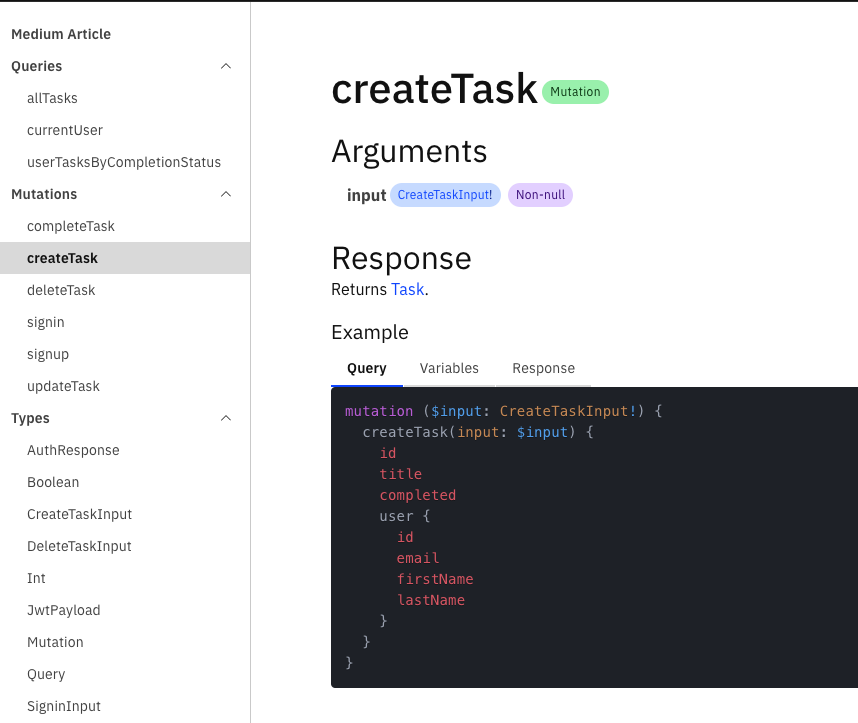

# Task API

Basic task management server using:

- GraphQL
- PostgreSQL (Docker)
- Apollo Server
- TypeORM
- JWT Auth


## Document preview




## Getting started
1. Install dependencies
```bash
npm install
```
2. Run Project
```bash
npm run start
```

## API documentation generated using magidoc

RUN:
```bash
magidoc generate
magidoc preview
```